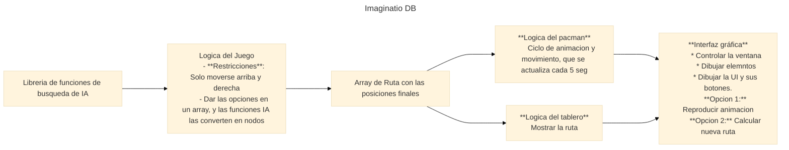

# UMNG IA. Taller de Arboles de búsqueda

Repostorio del taller 1 de la clase de Inteligencia Artificial de la UMNG.

---

A partir de este punto, la logica de la _IA_ será definida por el problema visto desde esta perspectiva:

> Busqueda de una ruta a través de un plano `(x,y)` donde se conoce el punto de inicio y el punto final

Ante esto se plantea el uso de las siguientes clases:

* Problema `[coordenada_inicial, coordenada_final]`
* Nodo `[posicion, costo, vecinos]`
* Vecinos `[vecino_up, vecino_right, vecino_down, vecino_left]`